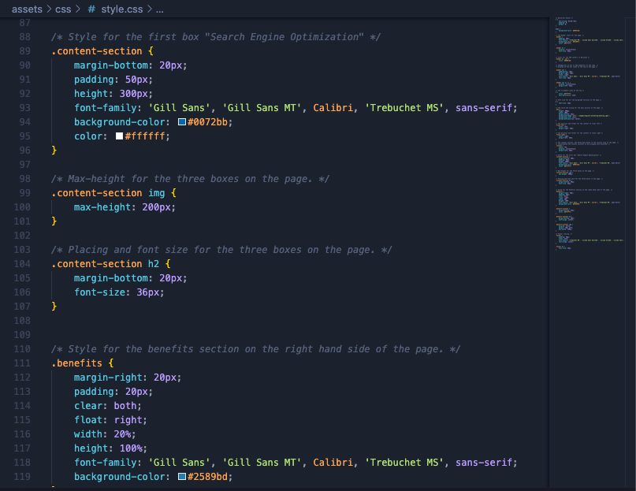
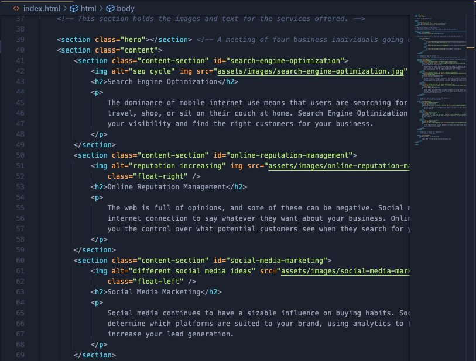

# ⭐ Horiseon Refactor

 The purpose of this project is to refactor the HTML and CSS files to make them more readable and accessible. This project aims to help my understanding of HTML Semantics, and how to properly build a functional CSS. div, section, header, id, and aside, these are some semantic elements that I have come to understand during this project. It has been difficult for me to be able to understand the structure of a webpage, and this project has allowed me to view a section of code, study what needs to be changed to it, and be able to implement changes to create a functioning website. I took the time to properly comment within the HTML and CSS files, so that the code can easily be navigated and understood.

# Website Link

https://goobber33.github.io/Horiseon-Refactor/#social-media-marketing

# Installation

Install the index.html, style.css and the images folder and run it in your own IDE. 

# Usage

 A screenshot of some sections of code from my HTML and CSS for this project. The website should resemble this screenshot when deployed.

Screenshots of the website

# Credits

The original code was from Xandromus from the University of Washington's coding bootcamp.